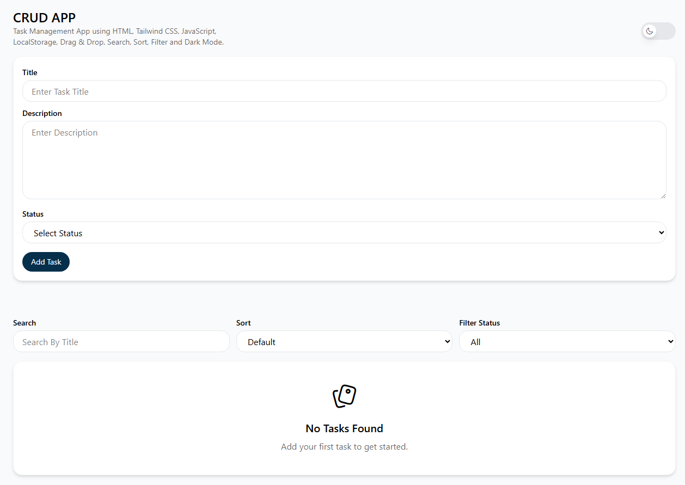
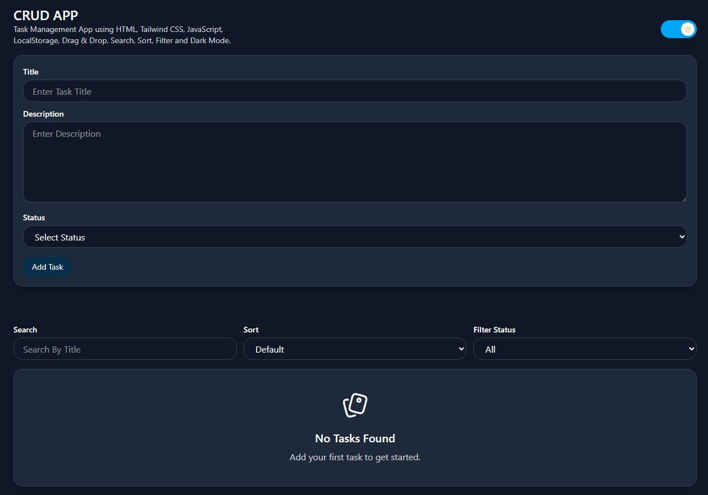
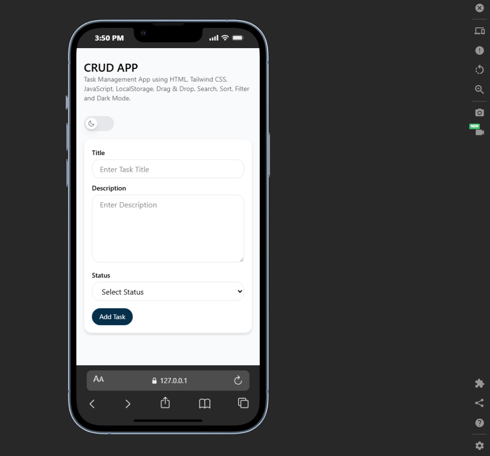

# 🚀 Advanced Task Management CRUD App

A modern and responsive Task Management Application built using:

- HTML5
- Tailwind CSS
- Vanilla JavaScript

The project includes advanced CRUD operations with modern UI/UX features.

---

# ✨ Features

✅ Create Tasks  
✅ Update Tasks  
✅ Delete Tasks  
✅ Search Tasks  
✅ Sort Tasks (A-Z / Z-A)  
✅ Filter by Status  
✅ Drag & Drop Reordering  
✅ LocalStorage Support  
✅ Responsive Design  
✅ Dark / Light Mode  
✅ Animated Theme Toggle  
✅ Toast Notifications  
✅ Confirmation Popup  
✅ Empty State UI  
✅ Event Delegation  

---

# 📸 Screenshots

## Light Mode



---

## Dark Mode



---

## Mobile Responsive



---

# 🛠️ Technologies Used

- HTML5
- Tailwind CSS
- Vanilla JavaScript
- Toastify.js
- LocalStorage API
- Drag & Drop API

---

# 📂 Project Structure

```bash
task-management-app/
│
├── index.html
├── index.js
├── README.md
├── style.css
│
├── screenshots/
│   ├── light-mode.png
│   ├── dark-mode.png
│   └── mobile.png
```

---

# 🌐 Live Demo
https://task-management-crud-app-nine.vercel.app/


